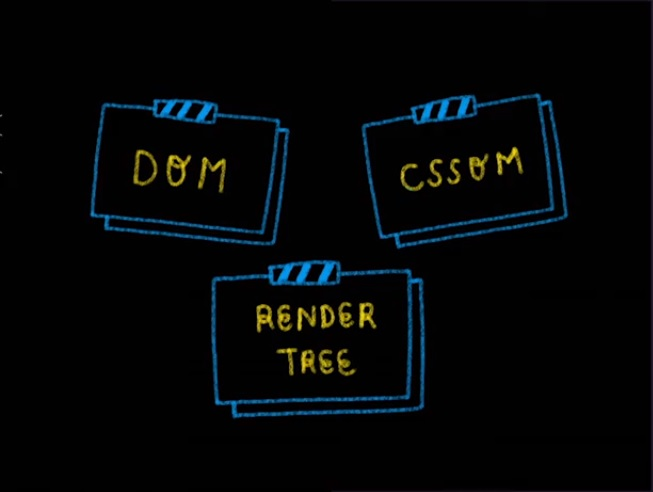
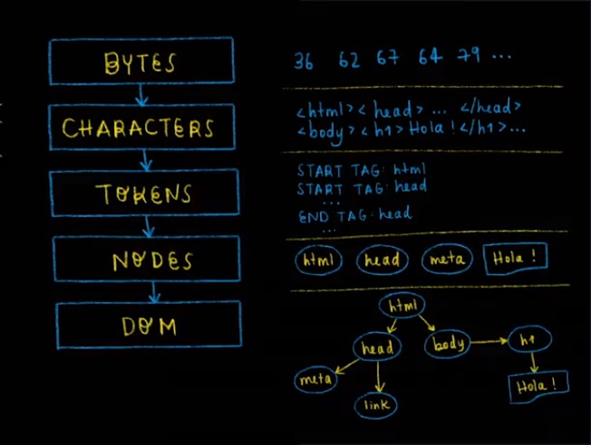
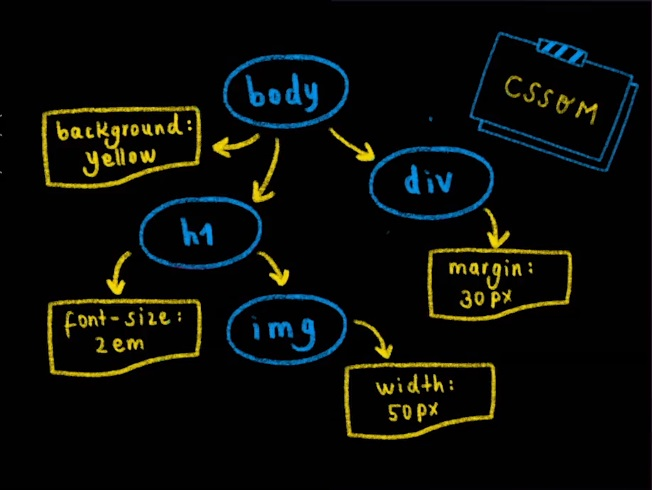
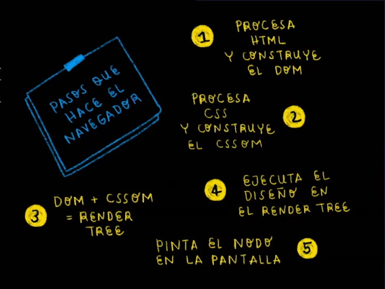

# Frontend Developer - Platzi
## Conceptos para el proceso de renderizado en la web

### DOM
transforma nuestro codigo HTML a objetos que son entendibles para el navegador
### CCSOM
Representación de objetos de CSS que son entendibles para el navegador
### RENDER TREE
Junta el DOM y el CSSOM para rendererizarlo en el navegador
## Pasos para tranformar nuestro código en algo entendible para el navegador

* Bytes
  * Transforma el código en bytes
* Characters
  * Tranforma los bytes a caracteres (UTF-8)
* Tokens
  * Tranformación de caracteres a tokens (HTML Tags)
* Nodes
  * Son los objetos que entiende el navegador
* DOM
  * Cojer los elementos y ponerlos en el Render Tree
* Integración del Dom con el CSSOM en el Render Tree

## Resumen del los pasos que hace el navegador
